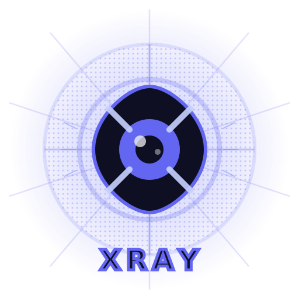

<p align="center">
  
</p>

<h1 align="center">@stinsky/xray</h1>

<p align="center">Click-to-component for React 19. Hover any element to see its React component name and source file, click to open in your editor. The only click-to-source inspector that works with React 19, Next.js 15+, and Turbopack.</p>

[](https://www.npmjs.com/package/@stinsky/xray)
[](./LICENSE)

## Features

- **Click to open source** — click any element to open its source file in VS Code, WebStorm, IntelliJ, or any editor
- **Component name overlay** — hover to see the React component name + file path
- **Works with React 19** — uses compile-time AST injection, not `fiber._debugSource` (removed in React 19)
- **All bundlers** — Next.js (Turbopack & Webpack), Vite, Webpack, Rspack, esbuild
- **Zero production cost** — fully tree-shaken, zero bytes in your production bundle
- **Floating toggle button** — auto-follows the Next.js dev indicator, or freely draggable with snap-to-corner in other setups
- **Keyboard shortcut** — `Cmd+Shift+X` to toggle (customizable)
- **Scroll-aware** — rAF-based tracking, works with smooth scrolling libraries (Lenis, etc.)
- **Interaction blocking** — all clicks/pointer events blocked while inspecting, no accidental navigation

## Why not react-dev-inspector / click-to-react-component / LocatorJS?

React 19 removed `fiber._debugSource`, which broke every existing click-to-component tool. These packages rely on runtime fiber inspection to find source locations — an approach that no longer works.

`@stinsky/xray` uses [`code-inspector-plugin`](https://github.com/nicolo-ribaudo/code-inspector-plugin) to inject `data-insp-path` attributes at compile time via AST transformation. This is the only approach that works reliably across React 18, React 19, and all modern bundlers.

## Install

```bash
npm install -D @stinsky/xray
```

## Setup

### 1. Add the build plugin

The plugin injects source location attributes on every DOM element at compile time. It does nothing in production builds.

#### Next.js (Turbopack)

```ts
// next.config.ts
import { xrayPlugin } from '@stinsky/xray/plugin'

const nextConfig = {
  turbopack: {
    rules: xrayPlugin({ bundler: 'turbopack' }),
  },
}

export default nextConfig
```

#### Next.js (Webpack)

```ts
// next.config.ts
import { xrayPlugin } from '@stinsky/xray/plugin'

const nextConfig = {
  webpack: (config) => {
    config.plugins.push(xrayPlugin({ bundler: 'webpack' }))
    return config
  },
}

export default nextConfig
```

#### Vite

```ts
// vite.config.ts
import { xrayPlugin } from '@stinsky/xray/plugin'

export default {
  plugins: [xrayPlugin({ bundler: 'vite' })],
}
```

#### Webpack

```ts
// webpack.config.js
const { xrayPlugin } = require('@stinsky/xray/plugin')

module.exports = {
  plugins: [xrayPlugin({ bundler: 'webpack' })],
}
```

### 2. Add the component

```tsx
// app/layout.tsx (Next.js) or your root component
import { Xray } from '@stinsky/xray'

export default function Layout({ children }) {
  return (
    <html>
      <body>
        {children}
        <Xray />
      </body>
    </html>
  )
}
```

The component is fully tree-shaken in production — zero bytes in your bundle. Bundlers replace `process.env.NODE_ENV`, detect the dead code path, and eliminate the entire inspector along with all its dependencies.

## Usage

- **Toggle**: `Cmd+Shift+X` or click the floating button
- **Hover**: Shows component name + source file path
- **Click**: Opens the source file in your editor

All clicks and pointer events are blocked while the inspector is active, so you won't accidentally trigger links or buttons.

## Props

| Prop | Type | Default | Description |
|------|------|---------|-------------|
| `hotKey` | `{ metaKey?, ctrlKey?, altKey?, shiftKey?, key }` | `{ metaKey: true, shiftKey: true, key: 'x' }` | Keyboard shortcut to toggle |
| `port` | `number` | `5678` | `code-inspector-plugin` server port |
| `color` | `string` | `'#6366f1'` | Accent color for overlay, tooltip, and button |
| `showButton` | `boolean` | `true` | Show the floating toggle button |
| `followNextIndicator` | `boolean` | `true` | Position button next to the Next.js dev indicator |

## Plugin options

| Option | Type | Default | Description |
|--------|------|---------|-------------|
| `bundler` | `'webpack' \| 'vite' \| 'turbopack' \| 'rspack' \| 'esbuild'` | — | **Required.** Your bundler |
| `editor` | `string` | `'code'` | Editor to open files in (`code`, `webstorm`, `idea`, etc.) |

## License

MIT
